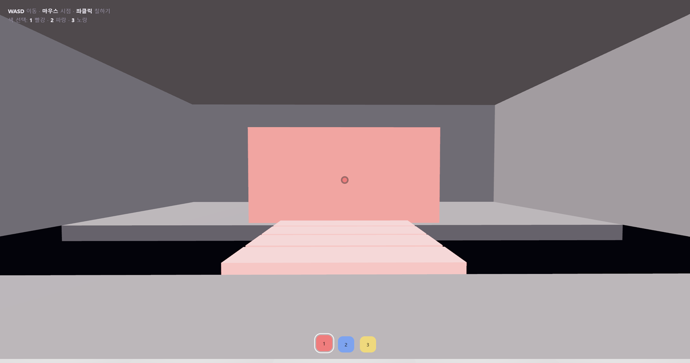
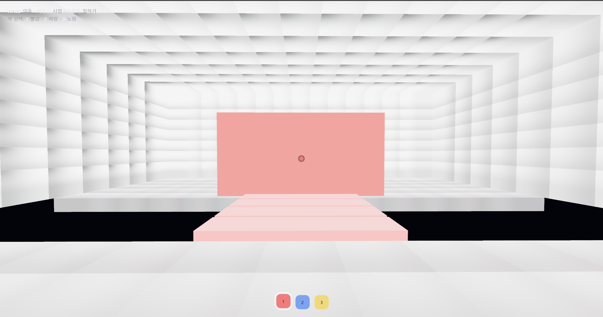
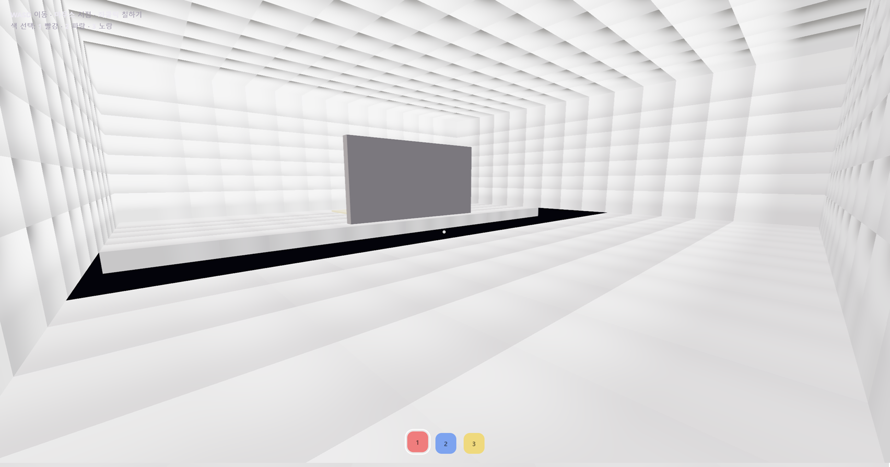
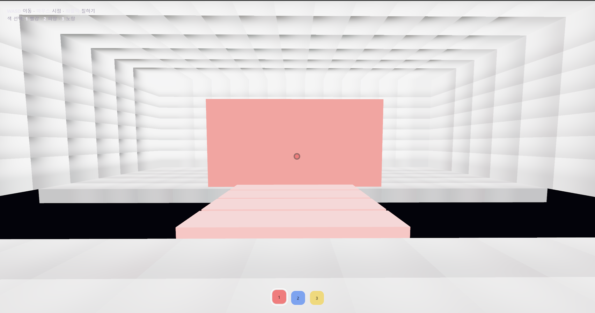
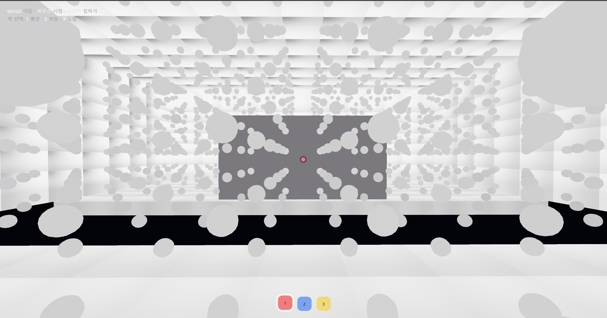
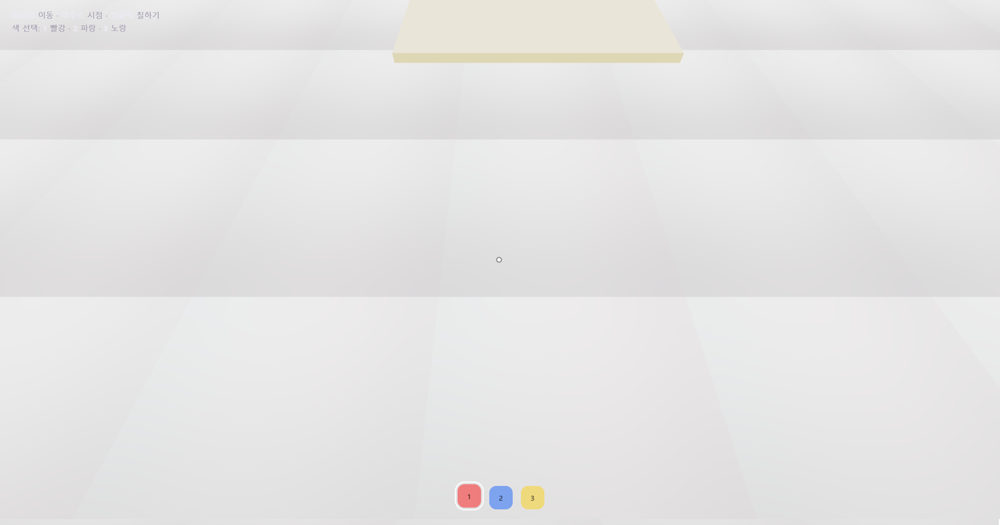

# Chroma Bloom — 컴퓨터 그래픽스 기말 프로젝트 리포트

> 흰 방을 물감으로 칠하면, 칠한 색이 **간접광(GI)으로 번져** 길을 여는 1인칭 퍼즐.

---

## 0. 실행 링크

- **게임(플레이):** `https://leemingyumingyu.github.io/chroma-bloom/`
- **리포트(MD):** `https://github.com/LeeMinGyuMinGyu/chroma-bloom/blob/main/report.md`

> 두 링크 모두 `main` 브랜치 기준이라 이후 커밋이 같은 URL에 반영된다.
> WebGPU 가속 환경(최신 Chrome/Edge)에서 DDGI 간접광이 표시되며, 미지원 환경에서도 게임 자체는 정상 구동된다.

---

## 1. 기획 (Tynan Sylvester, 『게임 기획의 정석』 프레임)

### 1.1 핵심 콘셉트
플레이어는 방에서 **단 하나의 동작 — "칠하기"** 만 가진다. 흰 표면에 색을 칠하면 그 색이
빛으로 번지고, 번진 빛이 길을 만든다. "빛을 직접 다루는 것"이 곧 퍼즐이다.

### 1.2 메카닉 → 이벤트 → 경험
- **메카닉:** 표면의 알베도(색)를 바꾸는 칠하기 + 그 색을 간접광으로 전파하는 DDGI.
- **이벤트:** 흰 패널을 칠하는 순간 빛이 번지며 *빛의 다리*가 나타난다.
- **경험:** "내가 칠한 색이 공간의 빛을 바꿨다"는 인과의 발견 — 통제감과 작은 쾌감.

**GI 끔(좌)/켬(우): 칠한 색이 간접광으로 번지는 차이**

### 1.3 우아함(elegance) & 의미 있는 선택
"칠한다"는 단일 규칙이 방마다 다른 색·배치로 반복되며 난이도와 변화를 만든다 → 적은 규칙으로 여러 상황.
어디에 무슨 색을 칠하느냐가 매 방에서 의미 있는 선택이 되도록 설계했다.

---

## 2. 게임 내용 (룰 · 색 시스템)

### 2.1 목표와 흐름
어두운 방, 앞에는 건널 수 없는 틈. 정면의 **흰 패널을 그 방의 지정색으로 칠하면** 반사광이
*빛의 다리*를 만들어 틈을 건너 출구에 도달하고, 다음 방으로 전환된다. 총 **3개 방**을 통과하면 클리어.

### 2.2 색 시스템 (3개 방)
각 방은 동일한 "칠하기 → 빛의 다리 → 건너기" 메커닉을 **서로 다른 색·팔레트·배치**로 반복한다.

| 방 | 지정색 | 월드 반응 | 구현 |
|---|---|---|---|
| 방 1 | 🔴 빨강 | 따뜻한 반사광이 빛의 다리를 켠다 → 건너기 | 구현 (DDGI 풀 적용) |
| 방 2 | 🔵 파랑 | 파랑 반사광이 빛의 다리를 켠다 → 건너기 | 구현 |
| 방 3 | 🟡 노랑 | 노랑 반사광이 빛의 다리를 켠다 → 건너기 | 구현 |

> 방 전환은 `roomManager.js`가 관리하며, **현재 보이지 않는 방은 씬에서 제거**해 렌더 비용을 줄인다(컬링).
> DDGI 간접광 연산은 비용을 고려해 **쇼케이스 방(방 1)에서 집중 적용**한다(§5.4).

---

## 3. 조작

| 입력 | 동작 |
|---|---|
| WASD | 이동 |
| 마우스 | 시점 |
| 좌클릭 | 조준한 표면 칠하기 |
| 1 / 2 / 3 | 빨강 / 파랑 / 노랑 선택 |
| G | DDGI 프로브 그리드 시각화 토글(디버그) |
| H | DDGI 간접광 주입 On/Off 토글 |
| R | 다시하기 |

---

## 4. 강의 개념 ↔ 구현 매핑

> 강의 개념사전(L1~L6, L11, GI)을 본 게임 구현에 매핑. **각 행을 본인 게임 캡쳐로 설명.**

### 4.1 좌표계·변환 / 파이프라인·공간 (L1~L2)
- **Model(World) Transform:** 모든 오브젝트를 `mesh.position.set(...)`으로 OS→WS 배치(이동·스케일 어파인 조합).
- **View Transform / View Matrix:** 카메라가 WS를 카메라 공간으로 변환(1인칭 시점).
- **Perspective Projection / FOV / Frustum:** `PerspectiveCamera(72°, aspect, near 0.1, far 300)`.

### 4.2 래스터화·컬링 (L3)
- **Z-Buffer / Occlusion:** 가까운 면이 먼 면을 가리는 가시성(렌더러 자동).
- **AABB:** 플레이어 이동을 방 경계 상자로 클램프하고 틈 통과를 차단(`player.js`).
- **View Frustum Culling(방 단위):** 현재 방만 씬에 유지하고 나머지 방은 제거(`roomManager.js`).

### 4.3 라이팅·셰이딩 (L4)
- **Lₑ (방출 복사휘도):** 칠한 패널과 다리 타일의 `emissive` 발광.
- **Direct vs Indirect Lighting:** 직접광(Ambient·Hemisphere·Directional) + 간접광(DDGI 번짐). 본 게임의 핵심 대비.
- **Ambient / Diffuse / Attenuation:** Hemisphere·Ambient(주변광), 람베르트 난반사.
- **Tone Mapping:** `ACESFilmicToneMapping`으로 하이라이트 롤오프(채널 클립 완화).

### 4.4 텍스처·맵 (L5~L6) — *대비 서술*
- **Albedo:** 칠하기 = 표면의 순수 재질색(알베도) 변경. 조명은 GI로 별도 적용.
- **Light Map / Baking과의 대비:** 정적 라이트맵을 굽지 않고 **동적 GI**로 간접광을 즉시 계산 → 칠한 색이
  실시간으로 번질 수 있는 이유.

### 4.5 회전 표현 (L11)
- **Euler Angles(Yaw·Pitch):** 시점을 `Euler(pitch, yaw, 0, 'YXZ')`로 구성(`player.js`).
- **Quaternion:** `camera.quaternion.setFromEuler(...)`로 자세 적용.
- **Gimbal Lock 회피:** pitch를 ±90° 직전으로 클램프.

---

## 5. GI 구현 상세 — DDGI (Dynamic Diffuse Global Illumination)

> 본 게임의 GI는 **DDGI**를 WebGPU 컴퓨트 셰이더(Three.js TSL)로 구현한다. 강의 개념사전의 용어
> (프로브 / Spherical Harmonics / 8-probe trilinear / spherical Fibonacci / recursive feedback)를 구현·서술한다.
> 단, 본 구현은 **가시성(occlusion) 항을 생략한 SH 기반 동적 irradiance 프로브 볼륨**으로, DDGI 계열의
> 경량 변형임을 정직하게 밝힌다(§5.3).

### 5.1 파이프라인 (구현한 그대로)
1. **프로브 그리드:** 방 공간에 3D 격자로 프로브 배치(`gi/ddgi.js`). 그리드 14×8×14 = **1,568 프로브**.
2. **저장 버퍼(SH):** 프로브당 **SH L1 = 4계수 × RGB** 를 GPU 스토리지 버퍼(`instancedArray`)에 보관.
   프레임 간 유지되어 시간 누적의 상태가 된다.
3. **광선 캡처(컴퓨트):** 각 프로브에서 **spherical Fibonacci** 분포로 **16방향** 광선을 쏜다.
   씬을 **AABB 박스 SDF 레이마칭**으로 교차시켜(웹엔 HW 레이트레이싱이 없으므로) 맞힌 면의
   (알베도 + 직접광) 복사휘도를 모은다.
4. **누적(SH) & 시간 수렴:** 광선들의 평균 복사휘도를 SH의 DC 항에 기록하되, 매 프레임
   `new = mix(old, sampled, α=0.04)` 로 **이전 값과 블렌딩**해 노이즈를 프레임에 걸쳐 수렴시킨다
   (recursive feedback). 폭주를 막기 위해 표본값을 `clamp(0,1)` 한다.
5. **동적 반영:** 플레이어가 칠한 패널 색을 **CPU-쓰기 가능한 스토리지 버퍼**로 매 프레임 컴퓨트에 전달 →
   칠한 색이 즉시 프로브 복사휘도에 반영된다.
6. **셰이딩 주입:** 벽·바닥·천장 머티리얼의 픽셀에서 월드 좌표로 **8-probe trilinear interpolation**
   (경계 완화를 위해 **smoothstep** 가중)으로 간접 irradiance를 구해 `emissiveNode`로 가산한다.

**H키로 GI 끔(off) / 켬(on) 비교**

### 5.2 구현 검증 단계 (개발 로그)
점진적으로 4단계로 나누어, 각 단계를 **프로브 디버그 점 색**으로 눈으로 검증했다.
- **M1 — 파이프라인:** `instancedArray` SH 버퍼 생성 + 컴퓨트가 프로브 슬롯에 값 기록 + 머티리얼이 그 버퍼를 읽음. (probes 출력 확인)
- **M2 — 레이마칭:** 아래 방향 광선 + 박스 SDF 교차 → 맞힌 면 색 기록. *틈 위 프로브가 아무 면도 못 맞혀 어둡게 비는 것*으로 레이마칭 동작을 검증.
- **M3 — SH 누적·시간 수렴·동적색:** 16방향 spherical Fibonacci + SH 누적 + 시간 블렌딩 + 칠한 색 반영(프로브 점이 칠한 색을 따라 변함).
- **M4 — 셰이딩 주입:** 8-probe trilinear → `emissiveNode` 가산으로 실제 벽·바닥에 간접광 표시. H 토글로 On/Off.

### 5.3 본 게임에서 GI가 필연인 이유
퍼즐의 단서는 "어떤 색이 *번졌는가*"로 읽힌다. 플랫/직접광만으로는 칠한 면만 색이 보이고
주변으로 번지지 않아 단서가 화면에 드러나지 않는다 → **간접광(GI)이 퍼즐을 가시화하는 핵심 수단.**

### 5.4 한계 (정직한 서술)
- **격자 아티팩트 / Light Leak:** 프로브 격자 해상도에 기인한 패턴이 벽에 미세하게 보일 수 있다.
  프로브 밀도 증가(7×4×7 → 14×8×14)와 **smoothstep 보간**으로 크게 완화했으나 완전 제거는 불가(DDGI 계열의 본질적 특성).
- **가시성 항 생략:** 차폐를 SH에 반영하지 않아 얇은 구조 뒤로 빛이 새는 누수가 가능(경량화 트레이드오프).
- **디퓨즈 한정:** 정반사(스펙큘러)는 다루지 않는다.
- **흰 방의 약한 대비:** 고알베도 흰 표면에서는 디퓨즈 color bleeding이 본래 은은하다. 천장·벽의 GI 알베도를
  낮추고 주입 강도를 높여 가시성을 확보했다.
- **하드웨어 요구:** 컴퓨트 기반이라 **WebGPU 하드웨어 가속**이 필요하다. 미지원 환경에서는 DDGI를 자동 비활성화하고
  게임은 표준 라이팅으로 정상 구동된다(0점 방지 설계).

---

## 6. 개발 과정 & 이슈

- 기술 스택: **Three.js r182 (`three/webgpu`, TSL) + WebGPURenderer**, GitHub Pages 정적 배포.
- 구조: 게임 레이어(표준 라이팅, 무조건 구동) + **DDGI 레이어(WebGPU 전용, additive, 실패 시 게임 무영향)**.
- 주요 이슈와 해결:
  - **모듈 경로/배포 정합성:** `src/` 구조와 `paint.js` 등 모듈 export 정합을 맞춰 import 오류 해결.
  - **uniform 런타임 변경 미반영:** 패널 동적색을 uniform이 아닌 **스토리지 버퍼**로 전달해 매 프레임 반영.
  - **간접광 폭주(색 깜빡임):** 표본 복사휘도를 `clamp(0,1)` 하여 채널 초과로 인한 색 진동 제거.
  - **격자 무늬:** 프로브 밀도 증가 + **smoothstep** trilinear 가중으로 완화.
  - **노출/대비:** ACES 톤매핑 + 조명·GI 알베도 튜닝으로 흰 방에서 색 번짐 가시성 확보.

---

## 7. 한계 & 향후 확장

- DDGI 가시성(Chebyshev/occlusion) 항 추가로 light leak 저감.
- 방 2·3에도 DDGI 적용 확대(현재는 방 1 집중).
- 1인칭↔탑뷰 **SLERP** 전환 및 **직교 투영(Orthographic)** 토글로 L11 보간/투영 추가 시연.
- 텍스처 UV 페인팅(붓 자국)으로 L5~L6 텍스처 단원 시연.

---

### ✅ 제출 전 최종 체크
- [x] 모든 항목에 본인 게임 캡쳐 삽입 완료
- [ ] §0 링크가 시크릿 창에서 열림 (게임 `leemingyumingyu` / repo `LeeMinGyuMinGyu`)
- [ ] `captures/` 폴더에 파일명이 본문과 정확히 일치
- [ ] repo가 **public**
- [ ] 가속 없는 브라우저에서도 게임이 시작·구동되는지 1회 확인
